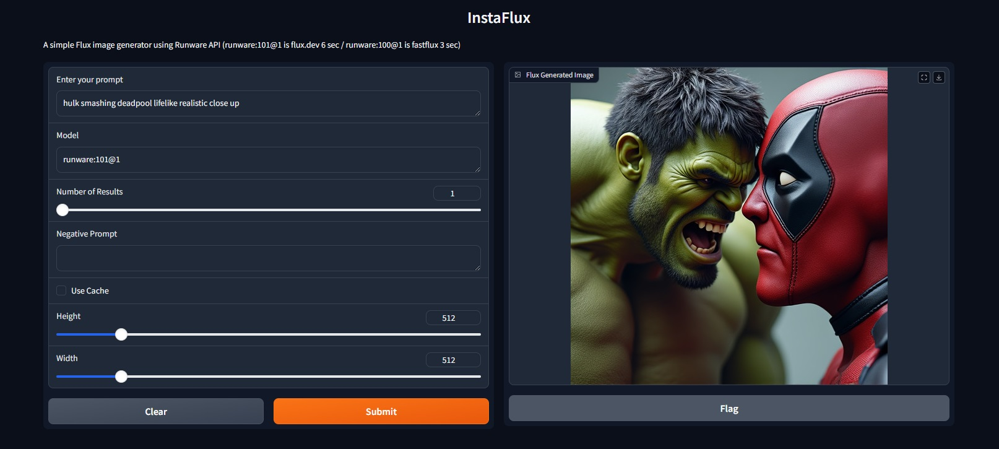

# InstaFlux


InstaFlux is a fast straightforward image generation tool that leverages the fast and affordable Runware API, built using Gradio. This application enables users to generate images from text prompts with various configuration options, requiring minimal coding knowledge or GPU environment setup with install scripts for windows and linux.

## Features

- Input text prompts to generate images.
- Configure the model, number of results, and image dimensions.
- Option to provide negative prompts and use caching.
- Fast flux 3 to 6 sec generation depending on model.
- Must setup runware.ai account for API key. (free $15 will make 1000 512x512 images for about $1)




## Quick Installation

To use the installation scripts:

- On Windows, save the `install.bat` file and double-click it to run.
- On Linux, save the `install.sh` file, give it execute permissions with `chmod +x install.sh`, and then run it with `./install.sh`.

(Note: The scripts pause before attempting to start the web UI, which won’t work until you add the API key to the `InstaFlux.py` file. After that, visit [http://127.0.0.1:7860](http://127.0.0.1:7860) in your browser.)

## Installation

Ensure you have Git, Python, and pip installed. (The above scripts should check for and install these if they are not present.)

1. Clone this repository:

    ```bash
    git clone https://github.com/PixifyAI/insta-flux
    ```

2. Navigate to the project directory:

    ```bash
    cd insta-flux
    ```

3. Create a virtual environment (optional but recommended):

    ```bash
    python -m venv venv
    source venv/bin/activate  # On Windows, use `venv\Scripts\activate`
    ```

4. Install the required packages:

    ```bash
    pip install -r requirements.txt
    ```

## Configuration

1. Replace `RUNWARE_API_KEY` in `InstaFlux.py` with your actual Runware API key.

## Usage

Run the application using:

```bash
python InstaFlux.py
```

The application will start a local server. Open your browser and navigate to [http://127.0.0.1:7860](http://127.0.0.1:7860) to access the Gradio interface.

## Troubleshooting

If you encounter issues related to themes or styling, ensure that your theme settings are correct or revert to default settings.

## License

This project is licensed under the MIT License - see the LICENSE file for details.
